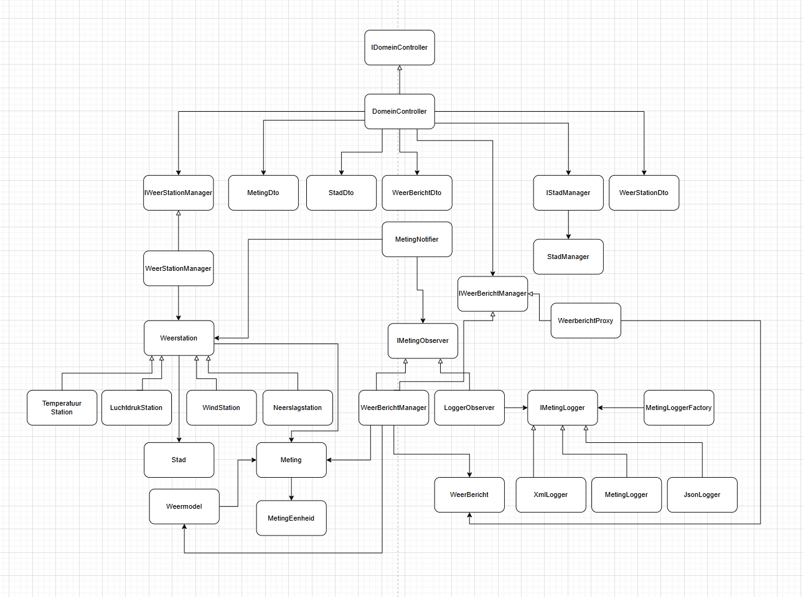

# WeerEventsApi
Applicatie voor het loggen en voorspellen van weersomstandigheden via weerstations.

## ✅ Build, Run & Test

### Vereisten
- .NET SDK 9

### Applicatie starten
```bash
   dotnet run
```
### Endpoints testen met .http file
```
### GET
GET http://localhost:5008/

###

### GET steden
GET http://localhost:5008/steden

###

### GET metingen
GET http://localhost:5008/metingen

###

### GET weerstations
GET http://localhost:5008/weerstations

###

### GET weerbericht
GET http://localhost:5008/weerbericht

###

### meting command
POST http://localhost:5008/commands/meting-command
Content-Type: application/json
```

## Klassendiagram

